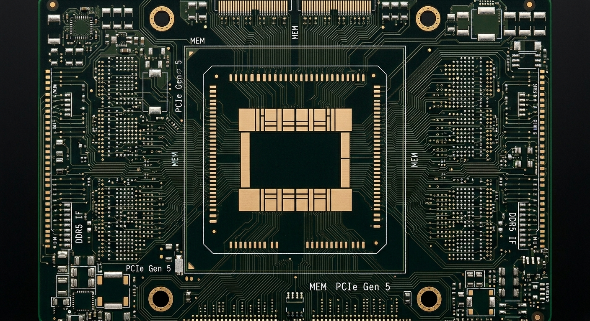

# KIRIN 9040 · 韬（τ）定律 — 产品展示页

<div align="center">
  
  <br/>
  <em>华为麒麟 9040 旗舰芯片 · 逻辑折叠架构产品展示网站</em>
  <br/><br/>
  <a href="https://kirin-tau-law.vercel.app" target="_blank">
    
  </a>
  <a href="https://kirin-tau-law.pages.dev" target="_blank">
    
  </a>
  <a href="https://huajielong.github.io/kirin-tau-law/" target="_blank">
    
  </a>
  <a href="https://github.com/huajielong/kirin-tau-law">
    
  </a>
  <a href="https://vercel.com/jielong-huas-projects/kirin-tau-law">
    
  </a>
</div>

---

## 🚀 在线体验

> **🇺🇳 Vercel:** [kirin-tau-law.vercel.app](https://kirin-tau-law.vercel.app)
>
> **🌐 Cloudflare:** [kirin-tau-law.pages.dev](https://kirin-tau-law.pages.dev)
>
> **🐙 GitHub Pages:** [huajielong.github.io/kirin-tau-law](https://huajielong.github.io/kirin-tau-law/)

三个站点任选，每次 `git push` 到 `main` 分支均自动更新。

## 概览

一款高端产品展示单页网站，为华为 "韬（τ）定律" 逻辑折叠芯片（麒麟 2026 / 9040 先进制程）打造。采用 **分屏布局**（左侧文字 + 右侧产品动画），通过滚动驱动的叙事方式逐层揭示芯片的技术革新。

### ✨ 核心特性

| 特性 | 说明 |
|------|------|
| 🎬 **滚动驱动视频播放** | Canvas 逐帧渲染产品动画，与滚动进度同步 |
| 📐 **分屏布局** | 左侧 1/3 文字区 + 右侧 2/3 产品展示区 |
| 🎯 **6 种动画类型** | 每个章节独特的 GSAP 入场动画（slide/fade/scale/clip/stagger） |
| 🌊 **Lenis 平滑滚动** | 丝滑的滚动体验 |
| 🌙 **全黑暗黑主题** | 纯黑背景 + 金色/科技蓝点缀，高端专业感 |
| 📊 **数据计数器** | 关键数据从 0 滚动计数动效 |
| 🔄 **横向走马灯** | 超大字号品牌文字横向滚动 |
| 📱 **响应式设计** | 桌面分屏 ↔ 移动端堆叠布局自适应 |
| 🔗 **锚点导航** | 顶部导航点击平滑跳转至对应章节 |

## 技术栈

- **HTML5** — 语义化结构
- **CSS3** — 自定义属性、Flexbox、响应式媒体查询
- **JavaScript (ES6+)** — 原生 JS，零构建工具
- **Lenis** — 平滑滚动库
- **GSAP + ScrollTrigger** — 高性能动画与滚动驱动
- **Canvas API** — 视频帧渲染
- **FFmpeg** — 视频帧提取（WebP 格式）

## 快速开始

```bash
# 1. 克隆仓库
git clone https://github.com/huajielong/kirin-tau-law.git
cd kirin-tau-law

# 2. 启动本地服务器
npx serve .
# 或
python -m http.server 8000

# 3. 浏览器打开
open http://localhost:3000
```

> **在线访问：**
> - 🇺🇳 [kirin-tau-law.vercel.app](https://kirin-tau-law.vercel.app) — Vercel 部署
> - 🌐 [kirin-tau-law.pages.dev](https://kirin-tau-law.pages.dev) — Cloudflare Pages 部署
>
> 无需本地运行，直接浏览器体验。
>
> **注意**：本地运行时由于 Canvas 帧通过 HTTP 加载，必须使用本地服务器（`file://` 协议无法加载帧资源）。

## 项目结构

```
kirin-tau-law/
├── index.html            # 主页面
├── css/
│   └── style.css         # 暗黑主题 + 响应式样式
├── js/
│   └── app.js            # Lenis + GSAP + Canvas 引擎
├── frames/               # 视频逐帧 WebP 图片（～91帧）
├── img/                  # 产品渲染图资源
├── video/                # 原始视频文件（gitignored）
├── audio/                # 音频资源（gitignored）
└── README.md
```

## 内容章节

| # | 章节 | 滚动范围 | 动画 | 视频匹配 |
|---|------|---------|------|---------|
| 1 | **何为韬定律** — 核心概念 | 14-26% | `slide-left` | 芯片亮相旋转 |
| 2 | **等效 2nm 制程** — 工艺突破 | 24-38% | `fade-up` | 层叠结构浮现 |
| 3 | **性能突破** — 能效/算力 | 36-50% | `scale-up` | 架构可视化 |
| 4 | **关键数据** — Stats | 48-62% | `stagger-up` | 数据可视化 |
| 5 | **架构革新** — 逻辑折叠 | 58-72% | `clip-reveal` | 架构收尾 |
| 6 | **CTA** — 了解更多 | 68-82% | `slide-right` | 终画面定格 |

## 设计理念

- **全黑背景**（`#000`）与产品动画无缝融合，构建沉浸式视觉体验
- **左侧文字**窄而聚焦（33vw），右侧产品宽而从容（67vw），形成阅读与观赏的节奏感
- **金色点缀**（`#c8a65e`）传达旗舰定位，**科技蓝**（`#4a7cf7`）呼应技术属性
- **Noto Serif SC** 标题衬线体 + **Noto Sans SC** 正文无衬线体，兼顾优雅与可读性

## 部署

### Vercel（自动部署）

项目已集成 **Vercel** 自动部署，每次推送至 `main` 分支自动构建上线：

[](https://kirin-tau-law.vercel.app)

| 环境 | 地址 |
|------|------|
| 🎯 生产环境 (Vercel) | [kirin-tau-law.vercel.app](https://kirin-tau-law.vercel.app) |
| 🎯 生产环境 (Cloudflare) | [kirin-tau-law.pages.dev](https://kirin-tau-law.pages.dev) |
| 🎯 生产环境 (GitHub Pages) | [huajielong.github.io/kirin-tau-law](https://huajielong.github.io/kirin-tau-law/) |
| 📊 Vercel 控制面板 | [Vercel Dashboard](https://vercel.com/jielong-huas-projects/kirin-tau-law) |
| 📊 Cloudflare 控制面板 | [Cloudflare Dashboard](https://dash.cloudflare.com) |
| 📊 GitHub 仓库 | [GitHub Repo](https://github.com/huajielong/kirin-tau-law) |

也可手动重新部署：

```bash
npx vercel --prod
```

## 本地开发

```bash
# 从视频提取帧（需安装 FFmpeg）
ffmpeg -i video/input.mp4 -vf "fps=18,scale=1920:-1" -c:v libwebp -quality 85 "frames/frame_%04d.webp"
```

## License

[MIT](LICENSE)

---

<p align="center">
  Made with ❤️ for KIRIN · 麒麟
</p>
